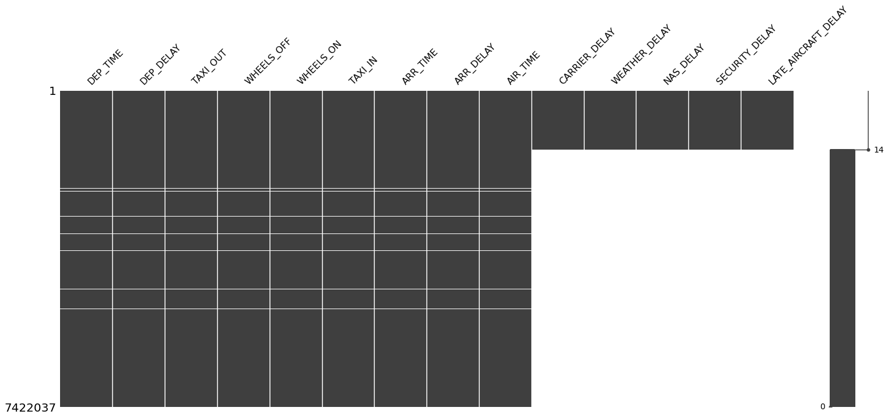
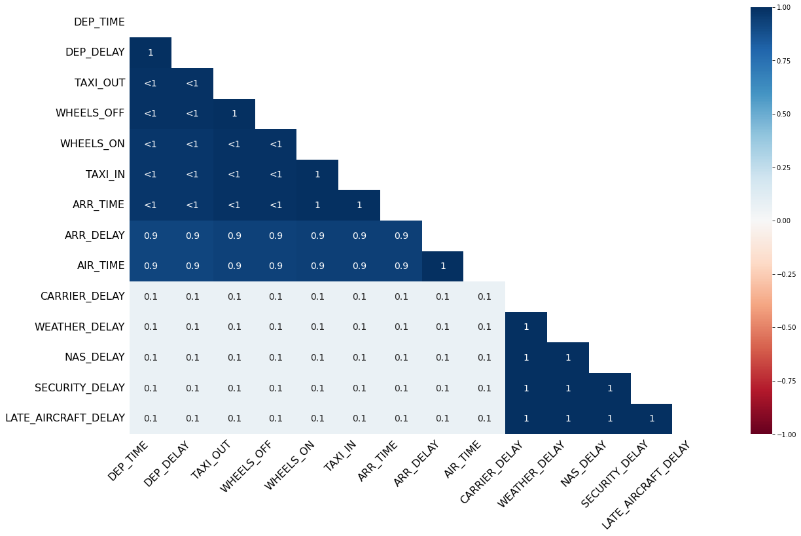

========
clean_df
========

.. image:: https://img.shields.io/pypi/v/clean_df.svg
        :target: https://pypi.python.org/pypi/clean_df

.. image:: https://img.shields.io/travis/naelaqel/clean_df.svg
        :target: https://travis-ci.com/naelaqel/clean_df

.. image:: https://readthedocs.org/projects/clean-df/badge/?version=latest
        :target: https://clean-df.readthedocs.io/en/latest/?version=latest
        :alt: Documentation Status

Python module to clean pandas dataframes fast and effectively.

Description and Features
------------------------
The first step of any data analysis project is to check and clean the data, in this module I implemented a very effiecint code that can:  

* Report your data frame to decide for actions, this report will show:  

  #. The column which has a unique value.
  #. The duplicated rows.
  #. The datatypes of columns that can optimize memory (based on columns' values).
  #. The outliers.
  #. The missing values (table, matrix, and heatmap).

* Clean Dataframe by dropping columns that have a high ratio of missing values, rows with missing values, and duplicated rows in the dataframe.

* Optimize the dataframe by converting columns to the desired data type and converting categorical columns to 'category' data type.

Installation
------------
To install `clean_df`, run this command in your terminal:

.. code-block:: 

    $ pip install clean_df

This is the preferred method to install `clean_df`, as it will always install the most recent stable release.

If you don't have `pip`_ installed, this `Python installation guide`_ can guide
you through the process.

.. _pip: https://pip.pypa.io
.. _Python installation guide: http://docs.python-guide.org/en/latest/starting/installation/

From sources
^^^^^^^^^^^^
The sources for `clean_df` can be downloaded from the `Github repo`_.

You can either clone the public repository:

.. code-block::

    $ git clone git://github.com/naelaqel/clean_df

Or download the `tarball`_:

.. code-block::

    $ curl -OJL https://github.com/naelaqel/clean_df/tarball/master

Once you have a copy of the source, you can install it with:

.. code-block::

    $ python setup.py install

.. _Github repo: https://github.com/naelaqel/clean_df
.. _tarball: https://github.com/naelaqel/clean_df/tarball/master
 

Usage examples
--------------
We will use 2009 Airline Delay dataset `2009.csv`, the dataset is available in `Kaggle`_.

.. _Kaggle: https://www.kaggle.com/datasets/sherrytp/airline-delay-analysis

Importing modules and dataset::

        >>> import pandas as pd   
        >>> from clean_df import CleanDataFrame   
        >>> df = pd.read_csv('2019.csv')  
        >>> df.info()
        
        <class 'pandas.core.frame.DataFrame'>
        RangeIndex: 7422037 entries, 0 to 7422036
        Data columns (total 21 columns):
        #   Column               Dtype  
        ---  ------               -----  
        0   FL_DATE              object 
        1   OP_UNIQUE_CARRIER    object 
        2   OP_CARRIER_FL_NUM    int64  
        3   ORIGIN               object 
        4   DEST                 object 
        5   DEP_TIME             float64
        6   DEP_DELAY            float64
        7   TAXI_OUT             float64
        8   WHEELS_OFF           float64
        9   WHEELS_ON            float64
        10  TAXI_IN              float64
        11  ARR_TIME             float64
        12  ARR_DELAY            float64 
        13  AIR_TIME             float64
        14  DISTANCE             float64
        15  CARRIER_DELAY        float64
        16  WEATHER_DELAY        float64
        17  NAS_DELAY            float64
        18  SECURITY_DELAY       float64
        19  LATE_AIRCRAFT_DELAY  float64
        20  Unnamed: 20          float64
        dtypes: float64(16), int64(1), object(4)
        memory usage: 1.2+ GB

The module has only one class ``CleanDataFrame``, we will assign it to variable ``cdf``::

        >>> cdf = CleanDataFrame(
                        df=df,             # the dataframe to be cleaned
                        max_num_cat=20     # maximum number of unique values in a column to be 
                        )                  # converted to categorical datatype, we will choose 20
                                           
                        

Reporting
^^^^^^^^^
Now, we can start apply the methods, first lets see the report about dataset::

        >>> cdf.report(
                show_matrix=True,   # show matrix missing values (from missingno package), default is True
                show_heat=True,     # show heat missing values (from missingno package), default is True
                matrix_kws={},      # if need to pass any arguments to matrix plot, default is {}
                heat_kws={}         # if need to pass any arguments to heat plot, default is {}
                )

        ============================= Unique Value Columns ============================
        - Checking if any column has a unique value ... 
        These columns has one value: ['Unnamed: 20'] 

        =============================== Duplicated Rows ===============================
        - Checking if data frame has duplicated rows ... No duplications.

        ============================= Optimization Columns ============================
        - Checking datatypes to optimize memory ... 
        These numarical columns can be down graded:
                                                                                                   columns
        uint16 	SECURITY_DELAY, OP_CARRIER_FL_NUM, WHEELS_ON, TAXI_IN, LATE_AIRCRAFT_DELAY, WEATHER_DELAY,
                CARRIER_DELAY, DISTANCE, NAS_DELAY, AIR_TIME, WHEELS_OFF, ARR_TIME, DEP_TIME
        uint8 	TAXI_OUT
        int16 	DEP_DELAY, ARR_DELAY

        These columns can be converted to categorical: ['OP_UNIQUE_CARRIER']  

        =================================== Outliers ==================================
        - Checking for outliers ... 
        Outliers are:  
                                outliers_lower  outliers_upper  outliers_total  outliers_percentage
        DEP_DELAY                         2739          992304          995043                13.41
        ARR_DELAY                         7560          700478          708038                 9.54
        TAXI_IN                              0          459317          459317                 6.19
        DISTANCE                             0          434371          434371                 5.85
        TAXI_OUT                             0          423957          423957                 5.71
        AIR_TIME                             0          389656          389656                 5.25
        CARRIER_DELAY                        0          160111          160111                 2.16
        LATE_AIRCRAFT_DELAY                  0          135923          135923                 1.83
        NAS_DELAY                            0          108634          108634                 1.46
        WEATHER_DELAY                        0           82237           82237                 1.11
        SECURITY_DELAY                       0            4531            4531                 0.06

        ================================ Missing Values ===============================
        - Checking for missing values ... 
        Missing details are:
                                missing_counts  missing_percentage
        WEATHER_DELAY                  6032784               81.28
        CARRIER_DELAY                  6032784               81.28
        SECURITY_DELAY                 6032784               81.28
        NAS_DELAY                      6032784               81.28
        LATE_AIRCRAFT_DELAY            6032784               81.28
        AIR_TIME                        153805                2.07
        ARR_DELAY                       153805                2.07
        TAXI_IN                         137647                1.85
        WHEELS_ON                       137647                1.85
        ARR_TIME                        137646                1.85
        WHEELS_OFF                      133977                1.81
        TAXI_OUT                        133977                1.81
        DEP_DELAY                       130110                1.75
        DEP_TIME                        130086                1.75

The report shows that:
  #. The column 'Unnamed: 20' has a unique value.
  #. No duplications.
  #. For optimization we can convert 13 columns to `uint16`, one column to `uint8`, two columns to `int16`, and one columns to `categorical` datatypes.
  #. 11 columns have outliers as detailed above.
  #. 14 columns have missing values as detailed shown (5 of them have more than 80% of missing values).

Cleaning
^^^^^^^^
To clean the dataframe (remove missing, unique value columns and duplication)::

        >>> cdf.clean(
                min_missing_ratio=0.05,    # the minimum ratio of missing values to drop a column, default is 0.05
                drop_nan=True              # if True, drop the rows with missing values after dropping columns 
                                           # with missingsa above min_missing_ratio
                drop_kws={},               # if need to pass any arguments to pd.DataFrame.drop(), default is {}
                drop_duplicates_kws={}     # same drop_kws, but for drop_duplicates function
                )
        >>> cdf.report()                   # to see the changes

        ============================= Unique Value Columns ============================
        - Checking if any column has a unique value ... No columns founded. 

        =============================== Duplicated Rows ===============================
        - Checking if data frame has duplicated rows ... No duplications.

        ============================= Optimization Columns ============================
        - Checking datatypes to optimize memory ... 
        These numarical columns can be down graded:

                                                                                                  columns
        uint16 	OP_CARRIER_FL_NUM, AIR_TIME, DISTANCE, WHEELS_ON, WHEELS_OFF, TAXI_IN, ARR_TIME, DEP_TIME
        uint8 	TAXI_OUT
        int16 	DEP_DELAY, ARR_DELAY

        These columns can be converted to categorical: ['OP_UNIQUE_CARRIER'].

        =================================== Outliers ==================================
        - Checking for outliers ... 
        Outliers are:

                        outliers_lower 	outliers_upper 	outliers_total 	outliers_percentage
        DEP_DELAY 	          2724 	        985149 	        987873 	              13.59
        ARR_DELAY 	          7560 	        700478 	        708038 	               9.74
        TAXI_IN 	             0 	        457327 	        457327 	               6.29
        DISTANCE 	             0 	        429454 	        429454 	               5.91
        TAXI_OUT 	             0 	        421829 	        421829 	               5.80
        AIR_TIME 	             0 	        389656 	        389656 	               5.36

        ================================ Missing Values ===============================
        - Checking for missing values ... No missing values.

The reason of changing in outlier values is that some rows were dropped.

Optimizing
^^^^^^^^^^
To optimize the dataframe (convert datatypes)::

        >>> cdf.optimize()
        >>> cdf.report()                # to see the changes after optimization

        ============================= Unique Value Columns ============================
        - Checking if any column has a unique value ... No columns founded. 

        =============================== Duplicated Rows ===============================
        - Checking if data frame has duplicated rows ... No duplications.

        ============================= Optimization Columns ============================
        - Checking datatypes to optimize memory ... No columns to optimize.

        =================================== Outliers ==================================
        - Checking for outliers ... 
        Outliers are:

                        outliers_lower 	outliers_upper 	outliers_total 	outliers_percentage
        DEP_DELAY 	          2724 	        985149 	        987873 	              13.59
        ARR_DELAY 	          7560 	        700478 	        708038 	               9.74
        TAXI_IN 	             0 	        457327 	        457327 	               6.29
        DISTANCE 	             0 	        429454 	        429454 	               5.91
        TAXI_OUT 	             0 	        421829 	        421829 	               5.80
        AIR_TIME 	             0 	        389656 	        389656 	               5.36

        ================================ Missing Values ===============================
        - Checking for missing values ... No missing values.

All is clear now, only we can see the outliers, the actions required with outliers is out of this module scope.

How much did we optimize?
^^^^^^^^^^^^^^^^^^^^^^^^^
Lets see our dataframe info after cleaning and optimizing::

        >>> cdf.df.info()

        <class 'pandas.core.frame.DataFrame'>
        Int64Index: 7268232 entries, 0 to 7422036
        Data columns (total 15 columns):
        #   Column             Dtype   
        ---  ------             -----   
        0   FL_DATE            object  
        1   OP_UNIQUE_CARRIER  category
        2   OP_CARRIER_FL_NUM  uint16  
        3   ORIGIN             object  
        4   DEST               object  
        5   DEP_TIME           uint16  
        6   DEP_DELAY          int16   
        7   TAXI_OUT           uint8   
        8   WHEELS_OFF         uint16  
        9   WHEELS_ON          uint16  
        10  TAXI_IN            uint16  
        11  ARR_TIME           uint16  
        12  ARR_DELAY          int16   
        13  AIR_TIME           uint16  
        14  DISTANCE           uint16  
        dtypes: category(1), int16(2), object(3), uint16(8), uint8(1)
        memory usage: 374.3+ MB 

Contributing
------------
See the ``CONTRIBUTING.rst`` file in this repository. Feel free to contact me for any subject through my:  

* `Email`_
* `LinkedIn`_
* `WhatsApp`_

Also, you are welcome to visit my personal `website`_

.. _Email: mailto:dev@naelaqel.com
.. _LinkedIn: https://www.linkedin.com/in/naelaqel1
.. _WhatsApp: https://wa.me/962796780232
.. _website: https://naelaqel.com

License
-------
Free software: MIT license. For more information, please see the ``LICENSE`` file. 

Documentation
-------------
* The full documentation is hosted on `ReadTheDocs`_.
* The source code is available in `GitHub`_.

.. _ReadTheDocs: https://clean_df.readthedocs.io
.. _GitHub: https://github.com/naelaqel/clean_df

Credits
-------
* This package was created with Cookiecutter_ and the `audreyr/cookiecutter-pypackage`_ project template.  
* I gained most of my knowledge through the `Datacamp Python Programmer`_ track, specially `Developing Python Packages`_ course.

.. _Cookiecutter: https://github.com/audreyr/cookiecutter
.. _`audreyr/cookiecutter-pypackage`: https://github.com/audreyr/cookiecutter-pypackage
.. _`Datacamp Python Programmer`: datacamp.pxf.io/P0JMNz
.. _`Developing Python Packages`: datacamp.pxf.io/ZdnM3q
