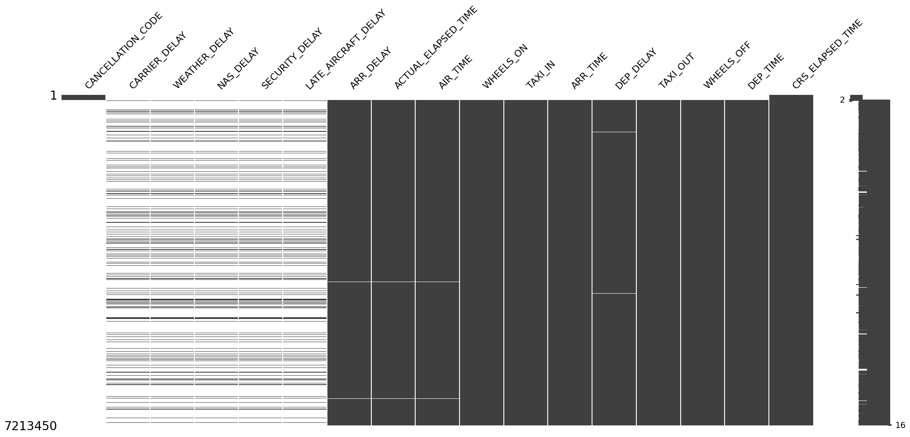
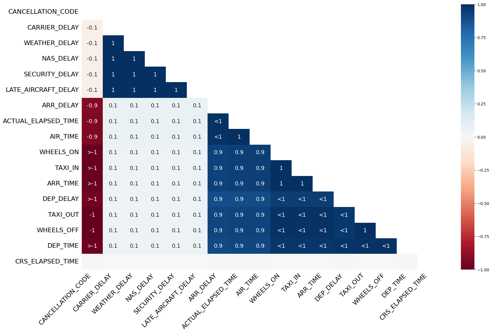

=====
Usage
=====

In this detailed example, we will use 2018 Airline Delay dataset, saved as ``2018.csv``, the dataset is available in `Kaggle`_.

.. _Kaggle: https://www.kaggle.com/datasets/sherrytp/airline-delay-analysis

Importing modules and dataset
-----------------------------
::

        >>> import pandas as pd   
        >>> from clean_df import CleanDataFrame   
        >>> df = pd.read_csv('2018.csv')  
        >>> df.info()
        
        <class 'pandas.core.frame.DataFrame'>
        RangeIndex: 7213446 entries, 0 to 7213445
        Data columns (total 28 columns):
         #   Column               Dtype  
        ---  ------               -----  
         0   FL_DATE              object 
         1   OP_CARRIER           object 
         2   OP_CARRIER_FL_NUM    int64  
         3   ORIGIN               object 
         4   DEST                 object 
         5   CRS_DEP_TIME         int64  
         6   DEP_TIME             float64
         7   DEP_DELAY            float64
         8   TAXI_OUT             float64
         9   WHEELS_OFF           float64
         10  WHEELS_ON            float64
         11  TAXI_IN              float64
         12  CRS_ARR_TIME         int64  
         13  ARR_TIME             float64
         14  ARR_DELAY            float64
         15  CANCELLED            float64
         16  CANCELLATION_CODE    object 
         17  DIVERTED             float64
         18  CRS_ELAPSED_TIME     float64
         19  ACTUAL_ELAPSED_TIME  float64
         20  AIR_TIME             float64
         21  DISTANCE             float64
         22  CARRIER_DELAY        float64
         23  WEATHER_DELAY        float64
         24  NAS_DELAY            float64
         25  SECURITY_DELAY       float64
         26  LATE_AIRCRAFT_DELAY  float64
         27  Unnamed: 27          float64
         dtypes: float64(20), int64(3), object(5)
         memory usage: 1.5+ GB

For our analysis, we will duplicate some rows::

        df = pd.concat([df, df.iloc[[1, 2, 2, 3]]])

The module has only one class ``CleanDataFrame``, we will assign it to variable ``cdf``::

        >>> cdf = CleanDataFrame(
                        df=df,             # the dataframe to be cleaned
                        max_num_cat=20     # maximum number of unique values in a column to be 
                        )                  # converted to categorical datatype, we will choose 20
                                           
        Founded useless columns (with single value) ... [Unnamed: 27] columns dropped.

Our class dropped the column ``Unnamed: 27`` automatically because it has one value only (useless).

Reporting
---------
Now, we can start apply the methods, first lets see the report about dataset::

        >>> cdf.report(
                show_matrix=True,   # show matrix missing values (from missingno package), default is True
                show_heat=True,     # show heat missing values (from missingno package), default is True
                matrix_kws={},      # if need to pass any arguments to matrix plot, default is {}
                heat_kws={}         # if need to pass any arguments to heat plot, default is {}
                )

        =============================== Duplicated Rows ===============================
        - Checking if data frame has duplicated rows ... 
        The dataset has 7 duplicated rows, which is 0.0% from the dataset, duplicated rows are:

          FL_DATE 	OP_CARRIER 	OP_CARRIER_FL_NUM 	ORIGIN 	DEST 	CRS_DEP_TIME 	DEP_TIME 	DEP_DELAY 	TAXI_OUT 	WHEELS_OFF 	... 	CRS_ELAPSED_TIME 	ACTUAL_ELAPSED_TIME 	AIR_TIME 	DISTANCE 	CARRIER_DELAY 	WEATHER_DELAY 	NAS_DELAY 	SECURITY_DELAY 	LATE_AIRCRAFT_DELAY 	Unnamed: 27
        1 2018-01-01 	UA 	        2427 	                LAS 	SFO 	1115     	1107.0 	        -8.0     	11.0     	1118.0   	... 	99.0            	83.0 	                65.0 	        414.0 	        NaN 	        NaN 	        NaN 	        NaN 	        NaN 	                NaN
        2 2018-01-01 	UA       	2426 	                SNA 	DEN 	1335 	        1330.0   	-5.0 	        15.0 	        1345.0 	        ... 	134.0 	                126.0    	        106.0    	846.0    	NaN      	NaN      	NaN      	NaN      	NaN      	        NaN
        3 2018-01-01 	UA 	        2425 	                RSW 	ORD 	1546    	1552.0 	        6.0      	19.0     	1611.0   	... 	190.0            	182.0 	                157.0 	        1120.0 	        NaN 	        NaN 	        NaN 	        NaN 	        NaN 	                NaN
        1 2018-01-01 	UA       	2427    	        LAS 	SFO 	1115 	        1107.0   	-8.0 	        11.0 	        1118.0 	        ... 	99.0 	                83.0 	                65.0     	414.0    	NaN      	NaN      	NaN      	NaN      	NaN              	NaN
        2 2018-01-01 	UA 	        2426    	        SNA 	DEN 	1335     	1330.0 	        -5.0     	15.0     	1345.0  	... 	134.0            	126.0    	        106.0 	        846.0 	        NaN 	        NaN 	        NaN 	        NaN 	        NaN      	        NaN
        2 2018-01-01 	UA      	2426            	SNA 	DEN 	1335 	        1330.0   	-5.0 	        15.0 	        1345.0 	        ... 	134.0    	        126.0 	                106.0    	846.0    	NaN      	NaN      	NaN      	NaN      	NaN              	NaN
        3 2018-01-01 	UA 	        2425 	                RSW 	ORD 	1546 	        1552.0 	        6.0 	        19.0    	1611.0  	... 	190.0 	                182.0   	        157.0 	        1120.0 	        NaN 	        NaN 	        NaN 	        NaN 	        NaN 	                NaN

        ============================= Optimization Columns ============================
        - Checking datatypes to optimize memory ... 
        These numarical columns can be down graded:
        
                columns
        int16 	DEP_DELAY, ARR_DELAY, CRS_ELAPSED_TIME
        uint8 	TAXI_OUT, CANCELLED, DIVERTED
        uint16 	OP_CARRIER_FL_NUM, CRS_DEP_TIME, DEP_TIME, WHEELS_OFF, WHEELS_ON, TAXI_IN, CRS_ARR_TIME, ARR_TIME, 
                ACTUAL_ELAPSED_TIME, AIR_TIME, DISTANCE, CARRIER_DELAY, WEATHER_DELAY, NAS_DELAY, SECURITY_DELAY, 
                LATE_AIRCRAFT_DELAY

        ============================= Categorical Columns =============================
        - Checking columns that can convert to categorical ... 
        These columns can be converted to categorical:

                                unique_values
        OP_CARRIER 	        9E, AA, AS, B6, DL, EV, F9, G4, HA, MQ, NK, OH, OO, UA, VX, WN, YV, YX
        CANCELLATION_CODE 	A, B, C, D

        =================================== Outliers ==================================
        - Checking for outliers ... 
        Outliers are:  
                                outliers_lower 	        outliers_upper 	outliers_total 	outliers_percentage
        DEP_DELAY        	3058.0     	        937650.0   	940708.0        13.26
        ARR_DELAY 	        9874.0     	        642724.0        652598.0  	9.22
        DISTANCE         	0.0                	432362.0  	432362.0        5.99
        TAXI_IN 	        0.0 	                428981.0        428981.0   	6.05
        TAXI_OUT         	0.0               	411112.0  	411112.0        5.79
        CRS_ELAPSED_TIME 	5.0 	                395338.0        395343.0  	5.48
        AIR_TIME 	        0.0       	        391119.0  	391119.0        5.53
        ACTUAL_ELAPSED_TIME 	0.0        	        371247.0        371247.0  	5.24
        CARRIER_DELAY 	        0.0               	155876.0  	155876.0        11.52
        LATE_AIRCRAFT_DELAY 	0.0 	                132029.0        132029.0  	9.76
        CANCELLED        	0.0                    	116584.0  	116584.0        1.62
        NAS_DELAY 	        0.0 	                100224.0        100224.0  	7.41
        WEATHER_DELAY    	0.0              	85055.0   	85055.0	        6.29
        DIVERTED 	        0.0 	                17859.0	        17859.0    	0.25
        SECURITY_DELAY 	        0.0       	        4348.0 	        4348.0 	        0.32

        ================================ Missing Values ===============================
        - Checking for missing values ... 
        Missing details are:
                                missing_counts 	missing_percentage
        CANCELLATION_CODE 	7096866.0 	98.38
        CARRIER_DELAY    	5860740.0 	81.25
        SECURITY_DELAY 	        5860740.0 	81.25
        NAS_DELAY        	5860740.0 	81.25
        WEATHER_DELAY 	        5860740.0 	81.25
        LATE_AIRCRAFT_DELAY 	5860740.0 	81.25
        ARR_DELAY        	137040.0   	1.90
        ACTUAL_ELAPSED_TIME 	134442.0        1.86
        AIR_TIME         	134442.0   	1.86
        TAXI_IN 	        119246.0        1.65
        WHEELS_ON        	119246.0  	1.65
        ARR_TIME 	        119245.0        1.65
        DEP_DELAY       	117234.0  	1.63
        TAXI_OUT 	        115830.0        1.61
        WHEELS_OFF      	115829.0  	1.61
        DEP_TIME 	        112317.0        1.56
        CRS_ELAPSED_TIME 	10.0 	        0.00

The report shows that:
  #. 7 duplicated rows.
  #. For optimization we can convert 16 columns to `uint16`, 3 columns to `uint8`, 3 columns to `int16`, and 2 columns to `categorical` datatypes.
  #. 15 columns have outliers as detailed above.
  #. 17 columns have missing values as detailed shown (6 of them have more than 80% of missing values).

Cleaning
--------
To clean the dataframe (remove missing, unique value columns and duplication)::

        >>> cdf.clean(
                min_missing_ratio=0.05,    # the minimum ratio of missing values to drop a column, default is 0.05
                drop_nan=True,             # if True, drop the rows with missing values after dropping columns 
                                           # with missingsa above min_missing_ratio
                drop_kws={},               # if need to pass any arguments to pd.DataFrame.drop(), default is {}
                drop_duplicates_kws={}     # same drop_kws, but for drop_duplicates function
                )
        >>> cdf.report()                   # to see the changes

        =============================== Duplicated Rows ===============================
        - Checking if data frame has duplicated rows ... No duplications.

        ============================= Optimization Columns ============================
        - Checking datatypes to optimize memory ... 
        These numarical columns can be down graded:

                columns
        int16 	DEP_DELAY, ARR_DELAY, CRS_ELAPSED_TIME
        uint8 	TAXI_OUT, CANCELLED, DIVERTED 
        uint16 	OP_CARRIER_FL_NUM, CRS_DEP_TIME, DEP_TIME, WHEELS_OFF, WHEELS_ON, TAXI_IN, CRS_ARR_TIME, ARR_TIME, 
                ACTUAL_ELAPSED_TIME, AIR_TIME, DISTANCE

        ============================= Categorical Columns =============================
        - Checking columns that can convert to categorical ... 
        These columns can be converted to categorical:

                        unique_values
        OP_CARRIER 	9E, AA, AS, B6, DL, EV, F9, G4, HA, MQ, NK, OH, OO, UA, VX, WN, YV, YX

        =================================== Outliers ==================================
        - Checking for outliers ... 
        Outliers are:

                                outliers_lower 	        outliers_upper 	outliers_total 	outliers_percentage
        DEP_DELAY 	        3048.0           	931179.0 	934227.0 	13.21
        ARR_DELAY        	9869.0 	                642674.0 	652543.0 	9.23
        DISTANCE 	        0.0              	427251.0 	427251.0 	6.04
        TAXI_IN          	0.0              	426694.0 	426694.0 	6.03
        TAXI_OUT 	        0.0             	408062.0 	408062.0 	5.77
        AIR_TIME 	        0.0 	                391119.0 	391119.0 	5.53
        CRS_ELAPSED_TIME 	1.0             	390605.0 	390606.0 	5.52
        ACTUAL_ELAPSED_TIME 	0.0 	                371246.0 	371246.0 	5.25

        ================================ Missing Values ===============================
        - Checking for missing values ... No missing values.

Optimizing
----------
To optimize the dataframe (convert datatypes)::

        >>> cdf.optimize()
        >>> cdf.report()                # to see the changes after optimization

        ============================= Unique Value Columns ============================
        - Checking if any column has a unique value ... No columns founded. 

        =============================== Duplicated Rows ===============================
        - Checking if data frame has duplicated rows ... No duplications.

        ============================= Optimization Columns ============================
        - Checking datatypes to optimize memory ... No columns to optimize.

        ============================= Categorical Columns =============================
        - Checking columns that can convert to categorical ... No columns to optimize.

        =================================== Outliers ==================================
        - Checking for outliers ... 
        Outliers are:

                                outliers_lower 	        outliers_upper 	outliers_total 	outliers_percentage
        DEP_DELAY 	        3048.0           	931179.0 	934227.0 	13.21
        ARR_DELAY        	9869.0 	                642674.0 	652543.0 	9.23
        DISTANCE 	        0.0              	427251.0 	427251.0 	6.04
        TAXI_IN          	0.0              	426694.0 	426694.0 	6.03
        TAXI_OUT 	        0.0             	408062.0 	408062.0 	5.77
        AIR_TIME 	        0.0 	                391119.0 	391119.0 	5.53
        CRS_ELAPSED_TIME 	1.0             	390605.0 	390606.0 	5.52
        ACTUAL_ELAPSED_TIME 	0.0 	                371246.0 	371246.0 	5.25

        ================================ Missing Values ===============================
        - Checking for missing values ... No missing values.

All is clear now, only we can see the outliers, the actions required with outliers is out of this module scope.

How much did we optimize?
-------------------------
Lets see our dataframe info after cleaning and optimizing::

        >>> cdf.df.info()

        <class 'pandas.core.frame.DataFrame'>
        Int64Index: 7071817 entries, 0 to 7213445
        Data columns (total 21 columns):
        #   Column               Dtype   
        ---  ------               -----   
        0   FL_DATE              object  
        1   OP_CARRIER           category
        2   OP_CARRIER_FL_NUM    uint16  
        3   ORIGIN               object  
        4   DEST                 object  
        5   CRS_DEP_TIME         uint16  
        6   DEP_TIME             uint16  
        7   DEP_DELAY            int16   
        8   TAXI_OUT             uint8   
        9   WHEELS_OFF           uint16  
        10  WHEELS_ON            uint16  
        11  TAXI_IN              uint16  
        12  CRS_ARR_TIME         uint16  
        13  ARR_TIME             uint16  
        14  ARR_DELAY            int16   
        15  CANCELLED            uint8   
        16  DIVERTED             uint8   
        17  CRS_ELAPSED_TIME     int16   
        18  ACTUAL_ELAPSED_TIME  uint16  
        19  AIR_TIME             uint16  
        20  DISTANCE             uint16  
        dtypes: category(1), int16(3), object(3), uint16(11), uint8(3)
        memory usage: 431.6+ MB

The module reduces the dataframe size from **1.5 GB** to around **430 MB**.

